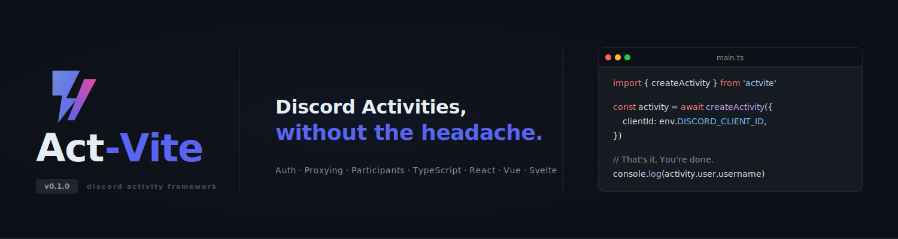

<div align="center">
  <br />
  
  <br />
  <br />
  <p>
    A developer framework for building Discord Activities.
    <br />
    Handles OAuth, proxying, and participant tracking — so you can focus on building.
  </p>
  <br />

  <a href="https://npmjs.com/package/act-vite">
    
  </a>
  
  <a href="https://github.com/jackson-peg/act-vite/blob/main/LICENSE">
    
  </a>
  <a href="https://github.com/jackson-peg/act-vite/stargazers">
    
  </a>
  <a href="https://github.com/jackson-peg/act-vite/actions">
    
  </a>

  <br />
  <br />

  <a href="https://jackson-peg.github.io/act-vite">Documentation</a>
  &nbsp;&nbsp;·&nbsp;&nbsp;
  <a href="https://jackson-peg.github.io/act-vite/guide/getting-started">Quick Start</a>
  &nbsp;&nbsp;·&nbsp;&nbsp;
  <a href="./examples">Examples</a>
  &nbsp;&nbsp;·&nbsp;&nbsp;
  <a href="./CHANGELOG.md">Changelog</a>

</div>

---



Act-Vite is a framework for building Discord Activities — the interactive embedded apps that run inside Discord voice channels. It was built because the alternative is copying the same OAuth boilerplate, proxy configuration, and participant tracking logic into every new project, and that gets old fast.

It wraps Discord's Embedded App SDK and handles the initialization ceremony: SDK setup, OAuth2 authorization, token exchange, iframe proxying, and participant subscriptions. What's left is your actual application.

## Installation

```bash
npm install act-vite
# or
pnpm add act-vite
```

Node.js 18 or higher is required.

## Quick Start

```bash
npx create-act-vite my-activity
cd my-activity
pnpm dev
```

Or install manually:

```ts
import { createActivity } from 'act-vite'

const activity = await createActivity({
  clientId: import.meta.env.VITE_DISCORD_CLIENT_ID,
})

console.log(activity.user.username)
console.log(activity.channel?.name)
console.log(activity.participants.length)
```

## Framework Integrations

| Framework | Import |
|---|---|
| React | `import { useActivity, useParticipants } from 'act-vite/react'` |
| Vue 3 | `import { useActivity } from 'act-vite/vue'` |
| Svelte | `import { useActivity } from 'act-vite/svelte'` |
| Vanilla TypeScript | `import { createActivity } from 'act-vite'` |

Server-side token exchange is available for Express, Hono, and Fastify via `act-vite/server`.

## What It Handles

**Authentication.** The Discord OAuth2 flow, code-to-token exchange, and SDK authentication are handled automatically by `createActivity()`. You provide a client ID and a token exchange endpoint; Act-Vite does the rest.

**Proxying.** Discord Activities run inside a sandboxed iframe. All external requests must be routed through Discord's proxy. Act-Vite patches the global fetch automatically so your API calls just work.

**Participants.** The connected participant list is fetched on init and kept in sync via Discord's subscription API. React developers get a `useParticipants()` hook that re-renders automatically when someone joins or leaves.

**TypeScript.** Every export is fully typed. Every option object has an interface. Every callback has typed parameters. Your editor will have complete information about the Act-Vite API at all times.

## Project Structure

Running `npx create-act-vite` generates the following structure:

```
my-activity/
├── client/             # Vite-powered frontend application
│   ├── src/
│   │   └── main.ts     # Entry point — createActivity() lives here
│   └── vite.config.ts
├── server/             # Token exchange server
│   └── index.ts        # POST /api/token endpoint
├── .env.example        # Required environment variables
└── package.json
```

## Star History

<a href="https://star-history.com/#jackson-peg/act-vite&Date">
  <picture>
    <source media="(prefers-color-scheme: dark)" srcset="https://api.star-history.com/svg?repos=jackson-peg/act-vite&type=Date&theme=dark" />
    <source media="(prefers-color-scheme: light)" srcset="https://api.star-history.com/svg?repos=jackson-peg/act-vite&type=Date" />
    
  </picture>
</a>

## Contributors

<a href="https://github.com/jackson-peg/act-vite/graphs/contributors">
  
</a>

Act-Vite was created and is primarily maintained by [Jackson](https://github.com/jackson-peg).
Contributions of any kind are welcome — see [CONTRIBUTING.md](./CONTRIBUTING.md).

## A Note on This Project

Act-Vite is one of the most substantial projects Jackson has built. It represents a significant investment of time — designing the API, handling the edge cases in Discord's auth flow, writing the framework adapters, building the CLI, and documenting all of it to a standard that developers can actually rely on.

It is released as open source because that's the right thing to do with infrastructure that the community needs. There is no company behind it, no funding, no team. Just a developer who wanted this tool to exist and built it.

If Act-Vite saves you time — even a few hours of OAuth boilerplate or iframe debugging — consider starring the repository. It costs nothing, takes two seconds, and it is the most direct way to signal that this work has value and should continue.

This is version 0.1.0. There is more to come.

## License

MIT — see [LICENSE](./LICENSE) for details.
